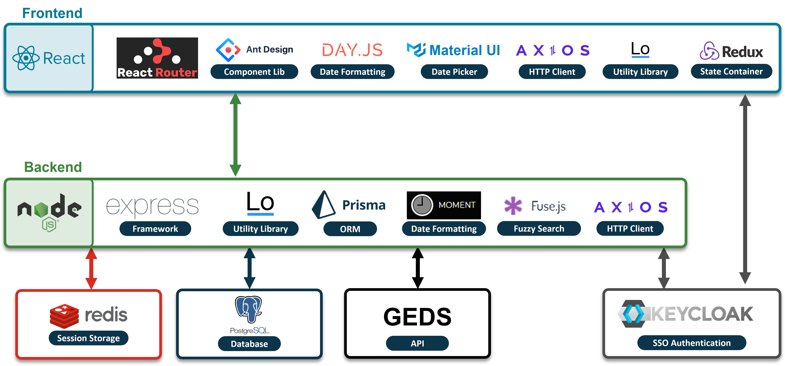

**An improved directory and employee search tool.**

# :wave: Introduction

I-Talent is an internal web-application that would enable employees to share information about their employment status, job position, skills, and credentials. ISED employees can login to I-Talent with their windows credentials, where they can create a profile or search for employees with the right expertise, education, competencies, experience and other essential qualifications at any time for talent management, staffing, succession planning, or simply for insight on a project or file.

## Helpful links

### Access the live testing environments

[](https://italent-development.apps.ocp.dev.ised-isde.canada.ca/)
[](https://italent-uat.apps.ocp.dev.ised-isde.canada.ca/)

[](https://italent-dev-cms-studioup-dev.apps.ocp.dev.ised-isde.canada.ca/en)
[](https://italent-uat-cms-studioup-dev.apps.ocp.dev.ised-isde.canada.ca/en)

### Testing and Building Services

[](https://sonarqube.ised-isde.canada.ca/dashboard?id=ITalent-frontend)
[](https://sonarqube.ised-isde.canada.ca/dashboard?id=ITalent-backend)
[](https://cicd.ised-isde.canada.ca/blue/organizations/jenkins/DSD%2FI-Talent%2FI-Talent/branches/)

### Hosting servers/services

[](https://console-openshift-console.apps.ocp.dev.ised-isde.canada.ca/topology/ns/italent-development?view=graph)
[](https://console-openshift-console.apps.ocp.dev.ised-isde.canada.ca/topology/ns/mytalent?view=graph)

# :pushpin: Table of Content

- [:wave: Introduction](#wave-introduction)
  - [Helpful links](#helpful-links)
    - [Access the live testing environments](#access-the-live-testing-environments)
    - [Testing and Building Services](#testing-and-building-services)
    - [Hosting servers/services](#hosting-serversservices)
- [:pushpin: Table of Content](#pushpin-table-of-content)
- [:star:Getting started](#stargetting-started)
  - [Background](#background)
    - [Docker](#docker)
    - [Git](#git)
  - [Step 1: Install VS Code](#step-1-install-vs-code)
  - [Step 2: Install Docker](#step-2-install-docker)
    - [Install Docker on Windows](#install-docker-on-windows)
    - [Install Docker on Mac](#install-docker-on-mac)
  - [Step 3: Install/Launch the App On Docker](#step-3-installlaunch-the-app-on-docker)
    - [Run on Windows](#run-on-windows)
    - [Run on Mac](#run-on-mac)
  - [Step 4: Try out the different services of the app](#step-4-try-out-the-different-services-of-the-app)
- [:gear: Advanced](#gear-advanced)
  - [Project Building Blocks](#project-building-blocks)
  - [Local Keycloak setup](#local-keycloak-setup)
- [Contribution](#contribution)
- [Contributors](#contributors)
- [Contact](#contact)

# :star:Getting started

## Background

### Docker

The project has been set up with Docker and Docker-Compose to simplify onboarding and standardize the development environment. Before getting started with this project, we strongly recommend you become comfortable with the basics of Docker.

**Useful links:**

- [Docker](https://docs.docker.com/get-started/overview/)
- [Docker Compose](https://docs.docker.com/compose/)

### Git

We use Git and GitHub to version control the project. Once again, we strongly recommend you become comfortable with these technologies before contributing to this project. You will also need a GitHub account prior to contributing.

**Useful links:**

- [Git](https://git-scm.com/)
- [GitHub](https://github.com/)

## Step 1: Install VS Code

We strongly recommend installing [VS Code](https://code.visualstudio.com/) for development. It provides seamless integration for docker and other tools that we can take advantage of for this project.

Please also install all of the following VS Code extentions:

- [ESLint Extension](https://marketplace.visualstudio.com/items?itemName=dbaeumer.vscode-eslint)
- [Prettier Extension](https://marketplace.visualstudio.com/items?itemName=esbenp.prettier-vscode)
- [Prisma Extension](https://marketplace.visualstudio.com/items?itemName=Prisma.prisma)
- [Remote-WSL Extension (required for Docker on Windows)](https://marketplace.visualstudio.com/items?itemName=ms-vscode-remote.remote-wsl)
- [Docker Extension](https://marketplace.visualstudio.com/items?itemName=ms-azuretools.vscode-docker)
- [Git Lens Extension](https://marketplace.visualstudio.com/items?itemName=eamodio.gitlens)

## Step 2: Install Docker

Docker helps standardize the development environment independent of the developer's OS. This gives us the flexibility to support Windows, Mac, and Linux. As we advance, we will highlight the steps to set up the project for windows and Mac but the steps should be similar for Linux.

### Install Docker on Windows

Docker now recommends using WSL2 instead of the traditional Hyper-V VM on Windows machines. This make the setup slightly different from docker on Mac, but it provides significant performance improvements over Hyper-V.

1. Before installing Docker, make sure you enable WSL for windows by using the following [Microsoft Dcoumentation](https://docs.microsoft.com/en-us/windows/wsl/install-win10) \*_we recommend ubuntu 20.04 LTS as the linux distro for WSL_\*

2. Install [Docker Desktop](https://www.docker.com/products/docker-desktop) for Windows

3. Configure Docker Desktop to use the WSL2 engine and set the default Distro to **ubuntu 20.04 LTS** using the following [guide](https://docs.docker.com/docker-for-windows/wsl/).

4. Don't try to open the project yet. there are a few more steps to go!

### Install Docker on Mac

Download and install [Docker Desktop for Mac](https://hub.docker.com/editions/community/docker-ce-desktop-mac?utm_source=docker&utm_medium=webreferral&utm_campaign=dd-smartbutton&utm_location=header)

## Step 3: Install/Launch the App On Docker

Because of the WSL2 configuration that we just did for Windows, the steps to get the project running is also slightly different for Windows vs. Mac.

### Run on Windows

Open the Ubuntu distro that you just installed in Windows by searching for it by name in the start menu. This will open a terminal window connected to the Ubuntu instance.

1. On the first bootup of the Ubuntu instance, it asks for a username and password. You can set these to whatever you would like. It will not affect the project. Just make sure you remember the password.
2. Use the command `git clone` to download the project in the home directory
3. Now `cd` into the project directory that was just downloaded
4. run the command `code .`
5. You should see an instance of VS code open. This instance of VS code is running in Windows but it is connected to the project directory inside the Linux instant. \*Magic of WSL\*
6. Please keep in mind that you may need to reinstall the VS Code extensions that we installed in the first stage in this "WSL enabled" instance of VS Code. Sometime these extension will get auto disabled in "WSL enabled" instance for security reasons.
7. At this stage you will need to create three files to define the environment variables, one at the root of the project and two in the `env` folder. To get those variables, ask the current developers.
8. Right-click on thr `docker-compose.yaml` file in the project directory and hit `compose up` from the menu. If you do not see this option, make sure the docker VS code extension is installed.
9. Wait a few minutes and the app should show up at [localhost:3000](http://localhost:3000)

### Run on Mac

Running the app on Mac is less involved and can be done with a few easy steps

1. Use the command `git clone` to download the project in the home directory
2. Now `cd` into the project directory that was just downloaded
3. run the command `code .`
4. At this stage you will need to create three files to define the environment variables, one at the root of the project and two in the `env` folder. To get those variables, ask the current developers.
5. Right-click on thr `docker-compose.yaml` file in the project directory and hit `compose up` from the menu. If you do not see this option, make sure the docker VS code extension is installed.
6. Wait a few minutes and the app should show up at [localhost:3000](http://localhost:3000)

## Step 4: Try out the different services of the app

You can now access different components of the web application:

- [localhost:3000](http://localhost:3000) - Application
- [localhost:5555](http://localhost:5555) - Prisma studio, database visualizer/editor
- [localhost:3031](http://localhost:3031) - Webpack analyzer (need to run `yarn analyze` in the frontend docker container)
- [localhost:8080](http://localhost:8080) - API endpoints
- [localhost:8080/api-docs](http://localhost:8080/api-docs) - API endpoints documentation
- [localhost:5432](http://localhost:5432) - PostgreSQL database

> Note: Internet connection is required to run the application unless you setup keycloak locally with the steps described in the [wiki](https://github.com/CDH-Studio/I-Talent/wiki/Local-Keycloak-setup)

Visit backend [README](services/backend/README.md) and the frontend [README](services/frontend/README.md) for more information.

# :gear: Advanced

## Project Building Blocks



## Local Keycloak setup

Keycloak is the SSO service that the app utilizes to authenticate users. Therefore, an Internet connection is required to run the application unless you setup keycloak locally with the steps described here:

1. Add the following docker-compose service to the docker-compose.yml file.

```yml
keycloak:
  container_name: "italent-keycloak"
  image: "jboss/keycloak"
  ports:
    - "8180:8180"
  volumes:
    - ./keycloak:/opt/jboss/keycloak/keycloak
  hostname: keycloak
  command:
    - "-Dkeycloak.import=/opt/jboss/keycloak/keycloak/realm-export.json -Djboss.http.port=8180"
  environment:
    DB_VENDOR: postgres
    DB_ADDR: postgres
    DB_PORT: 5432
    DB_DATABASE: testdb
    DB_USER: api
    DB_PASSWORD: api
    KEYCLOAK_USER: administrator
    KEYCLOAK_PASSWORD: password
```

2. Update the KEYCLOAK_AUTH_SERVER_URL variable in your web.env and backend.env files to refer to http://localhost:8180/auth

The credentials for the users when using the local keycloak are specified in the [realm-export.json](./keycloak/realm-export.json) file

# Contribution

We encourage contributions to the project! We are a friendly team and are always looking for things to improve on. We just as that you follow our [contribution guidelines ](CONTRIBUTING.md) to help us keep things well documented and organized.

# Contributors

Our full stack developers

| **Active developers**                                         | **Previous developers**                                            |
| ------------------------------------------------------------- | ------------------------------------------------------------------ |
| [Ali Nouri](https://www.linkedin.com/in/a-nouri/)             | [Trevor Bivi](https://www.linkedin.com/in/trevor-bivi-736181193/)  |
| [Mohamed Radwan](https://www.linkedin.com/in/mo-radwan/)      | [Benoît Jeaurond](https://www.linkedin.com/in/benoit-jeaurond/)    |
| [Rizvi Rab](https://www.linkedin.com/in/rizvi-rab-370327160/) | [Kate Thornley](https://www.linkedin.com/in/kate-a-w-thornley/)    |
|                                                               | [Mamadou Bah](https://www.linkedin.com/in/mamadou-bah-9962a711b/)  |
|                                                               | [Sagal Maxamud](https://www.linkedin.com/in/s-glmxmd/)             |
|                                                               | [Sukhsimranpreet Sekhon](https://www.linkedin.com/in/sukhusekhon/) |

# Contact

This application is developed by students at [CDH Studio](https://cdhstudio.ca/)
