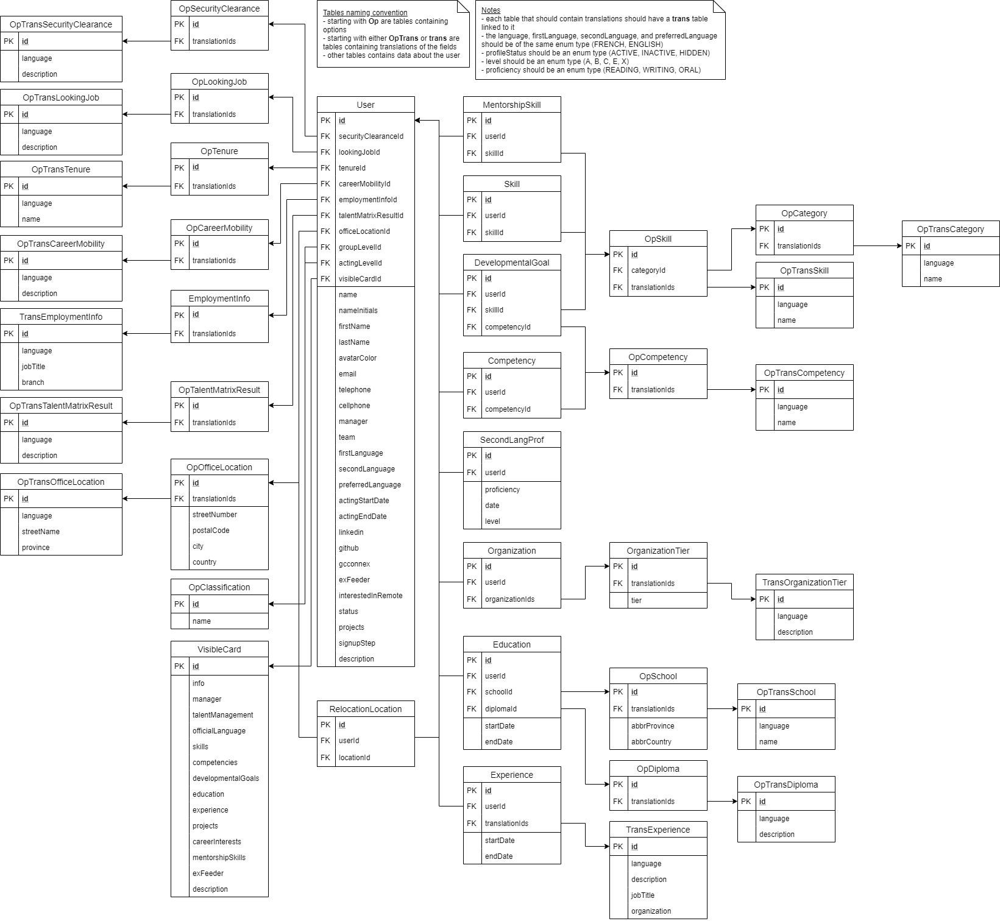

# I-Talent backend

Backend for I-Talent built on top of the node.js framework [expressjs](https://expressjs.com/), using [prisma.io](https://prisma.io/) as the database ORM, and using [swagger-ui](https://swagger.io/tools/swagger-ui/) for documentation.

## Folder structure

- `src/` - Almost everything is inside this folder
  - `auth/` - Authentication for keycloak
  - `core/` - Endpoint logic, database manipulations
  - `database/`
    - `migrations/` - Database migrations managed by prisma migrate
    - `seeds/` - Seeds for the database
  - `docs/` - Documentation for the backend (swagger config files and database diagram)
  - `router/` - Express.js routers alongside with the validation for the endpoints
- `tests/` - Tests for the backend

## Database diagram

The database diagram has been create with [draw.io](draw.io), and can be modified with the .xml file in the docs folder

